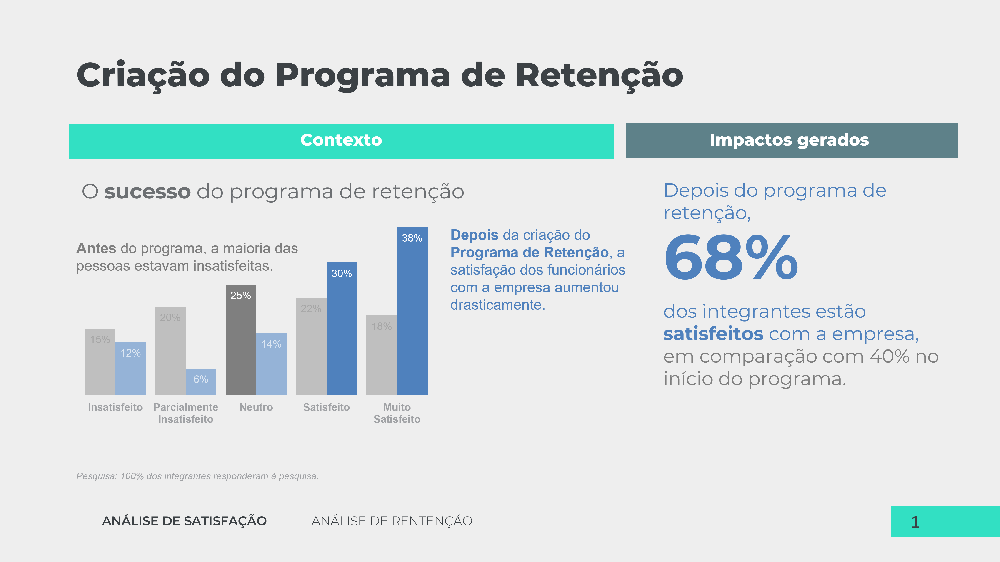
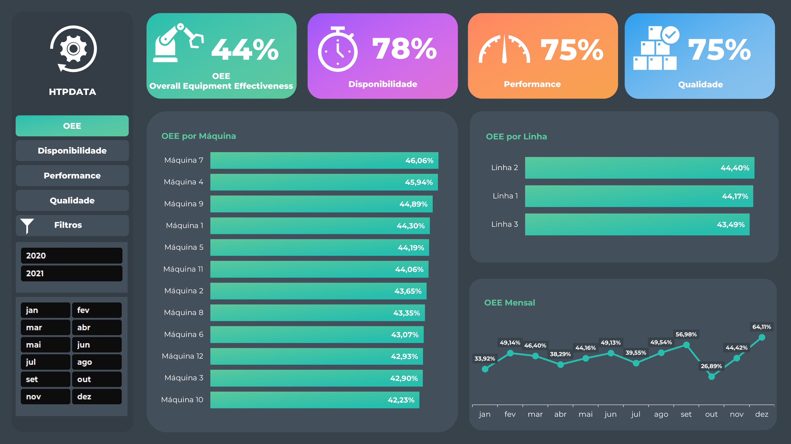
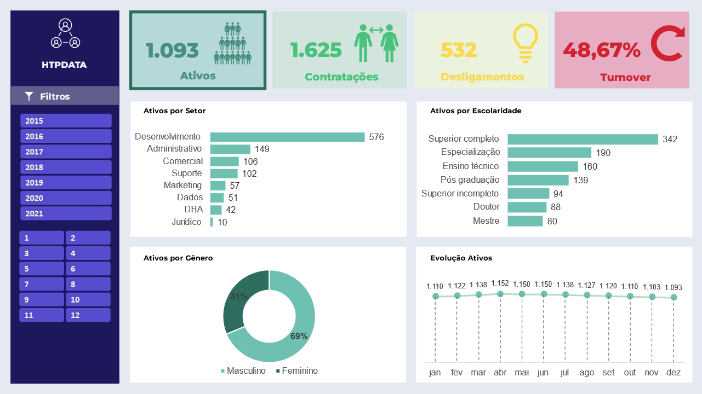
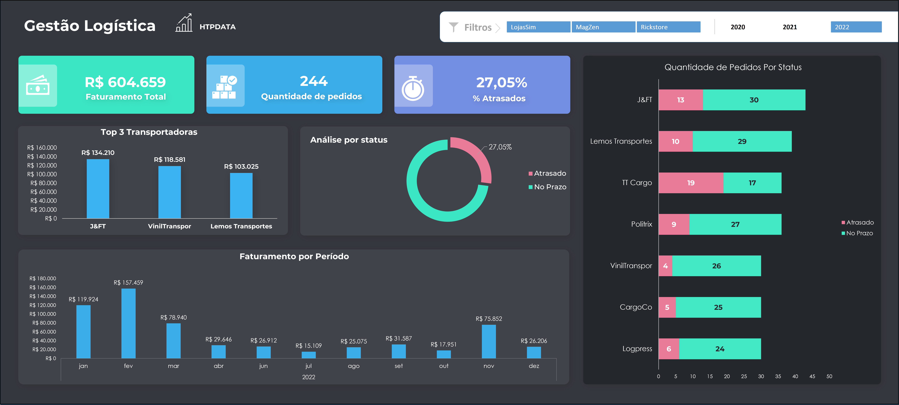
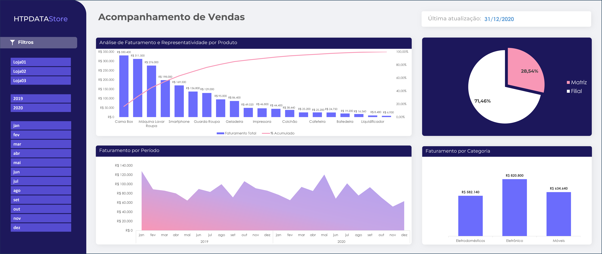
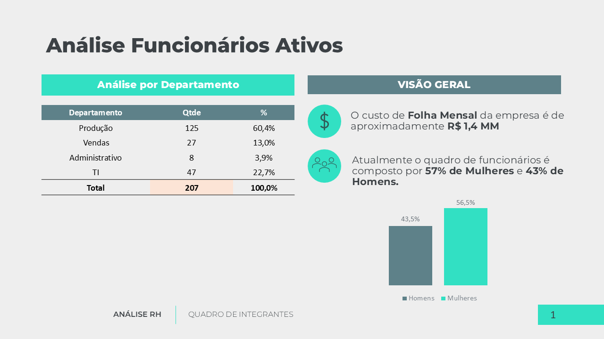
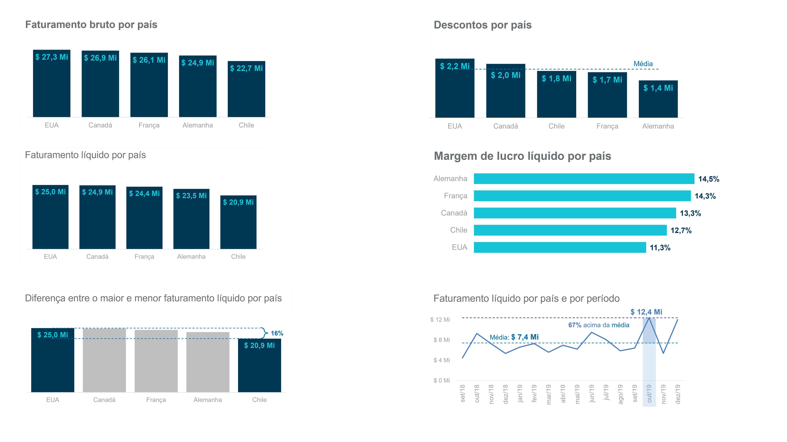
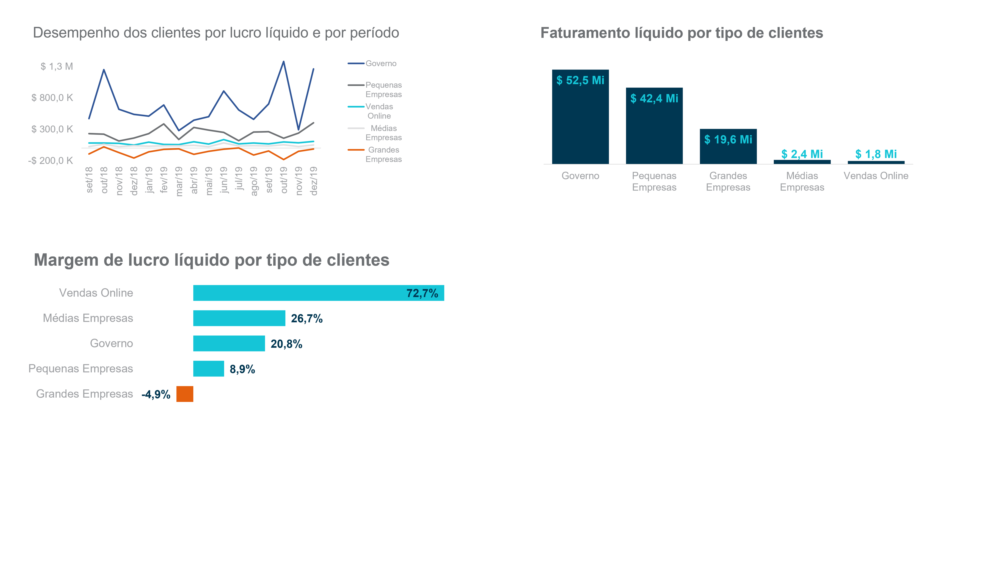

# Projetos Excel

Este repositório é dedicado a projetos de análise de dados com o Excel.

## Índice de Projetos

1. [Storytelling com dados usando o Excel e o PowerPoint](#projeto-01)
2. [Análise de Desempenho de Produção: OEE, Disponibilidade, Performance e Qualidade](#projeto-02)
3. [Recursos Humanos: Monitoramento de Ativos, Contratações, Desligamentos e Turnover](#projeto-03)
4. [Gestão Logística](#projeto-04)
5. [Acompanhamento de Vendas](#projeto-05)
6. [People Analytics](#projeto-06)
7. [Análise de Vendas](#projeto-07)
8. [Análise de Investimento em uma Franquia](#projeto-08)
9. [Simulação Financeira](#projeto-09)

---

## 🚀 Projetos

### Storytelling com dados usando o Excel e o PowerPoint

**[Projeto 01 - Link](https://github.com/marcelomduarte/storytelling_data_excel_powerpoint) | Atualizado: 12/03/2024**

[Índice ↑](#indice)

---

### Análise de Desempenho de Produção: OEE, Disponibilidade, Performance e Qualidade

**[Projeto 02 - Link](https://github.com/marcelomduarte/producao_industrial_oee_excel) | Atualizado: 12/03/2024**

[Índice ↑](#indice)

---

### Recursos Humanos: Monitoramento de Ativos, Contratações, Desligamentos e Turnover

**[Projeto 03 - Link](https://github.com/marcelomduarte/rh_indicadores_excel) | Atualizado: 12/03/2024**

[Índice ↑](#indice)

---

### Gestão Logística

**[Projeto 04 - Link](https://github.com/marcelomduarte/gestao_logistica_excel) | Atualizado: 12/03/2024**

[Índice ↑](#indice)

---

### Acompanhamento de Vendas

**[Projeto 05 - Link](https://github.com/marcelomduarte/acompanhamento_de_vendas_excel) | Atualizado: 12/03/2024**

[Índice ↑](#indice)

---

### People Analytics

**[Projeto 06 - Link](https://github.com/marcelomduarte/people_analytics_excel) | Atualizado: 18/08/2024**

[Índice ↑](#indice)

---

### Análise de Vendas

**[Projeto 07 - Link](https://github.com/marcelomduarte/analise_de_vendas_excel_power_bi) | Atualizado: 18/08/2024**

[Índice ↑](#indice)

---

### Análise de Investimento em uma Franquia
											

**[Projeto 08 - Link](https://github.com/marcelomduarte/analise_de_investimento_excel) | Atualizado: 12/03/2024**

[Índice ↑](#indice)

---

### Simulação Financeira

**[Projeto 09 - Link](https://github.com/marcelomduarte/simulacao_financeira_excel) | Atualizado: 12/03/2024**

[Índice ↑](#indice)

